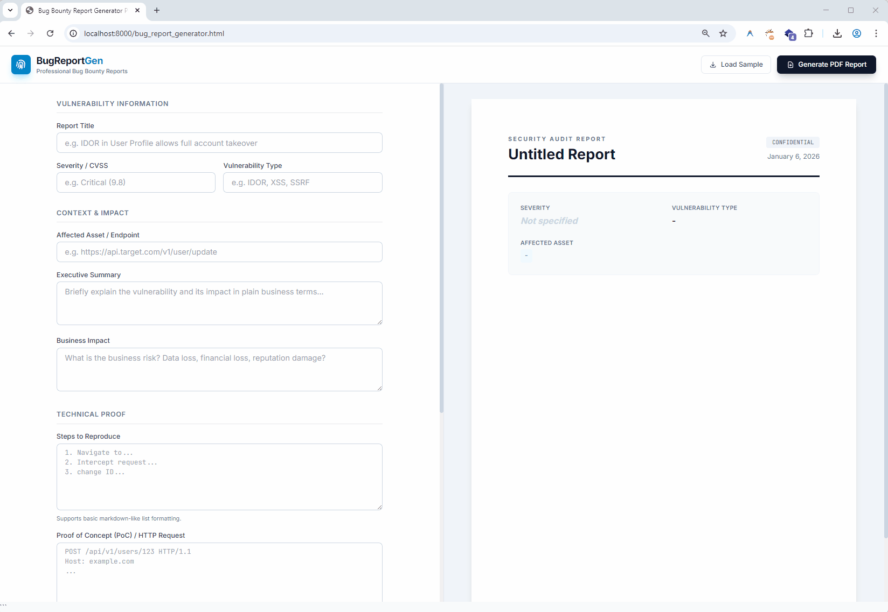

# BugReportGen 🛡️

**Professional Bug Bounty Report Generator** - Create clean, professional PDF reports for your bug bounty submissions instantly. 

## 🚀 Overview

**BugReportGen** is a lightweight, single-file HTML tool designed for security researchers and bug hunters. It allows you to write vulnerability reports in a clean editor and instantly preview them as they would look in a PDF. 

With one click, you can export a perfectly formatted **A4 PDF** ready to be attached to your HackerOne, Bugcrowd, or private program submission.

## ✨ Features

-   **📄 Smart PDF Generation**: Automatically handles A4 pagination. No more awkward text cut-offs or halfway-split images. It detects content overflow and moves sections intelligently.
-   **🔒 100% Client-Side**: No server backend. Your findings, sensitive data, and PoCs **never leave your browser**. Everything is generated locally.
-   **⚡ Live Preview**: See exactly how your report will look as you type.
-   **🖼️ Image Support**: Upload multiple Proof-of-Concept (PoC) screenshots. They are automatically resized and arranged in the PDF.
-   **📝 Sample Data**: Includes a "Load Sample" button to quickly demonstrate the layout and fields.
-   **✨ Modern UI**: Built with **Tailwind CSS** for a clean, distraction-free writing experience.

## 🛠️ How to Use

1.  Download the `bug_report_generator.html` file or just visit https://daudaldi.github.io/tools/reportgen.html.
2.  Open it in any modern web browser (Chrome, Firefox, Edge, etc.).
3.  Fill in the details of your finding (Title, Severity, Steps to Reproduce, etc.).
4.  Upload screenshots if needed.
5.  Click **"Generate PDF Report"** to download your report.

## 🧱 Tech Stack

-   **HTML5 & JavaScript** (Vanilla)
-   **Tailwind CSS** (via CDN) for styling.
-   **jsPDF** & **html2canvas** (via CDN) for PDF rendering.

## 🤝 Contributing

Feel free to fork this repository, make improvements, or customize the template to match your branding!

---
*Created with ❤️ for the Bug Bounty Community.*
